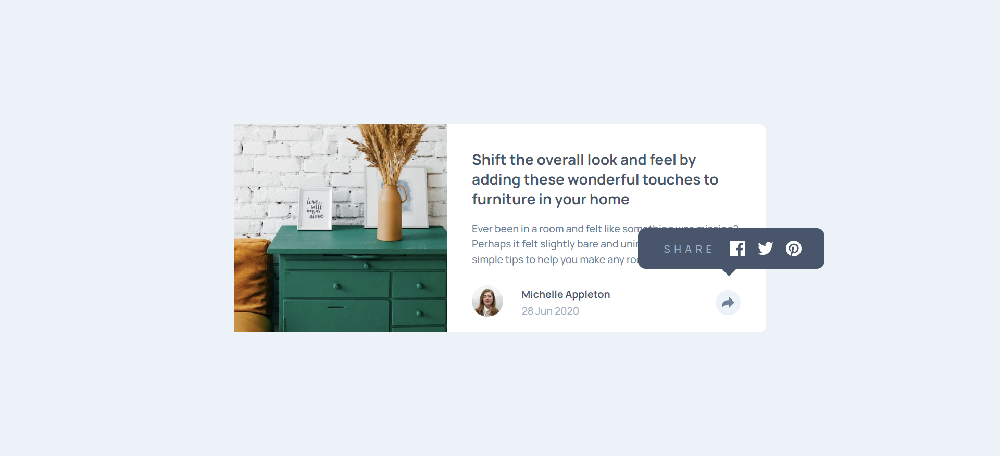
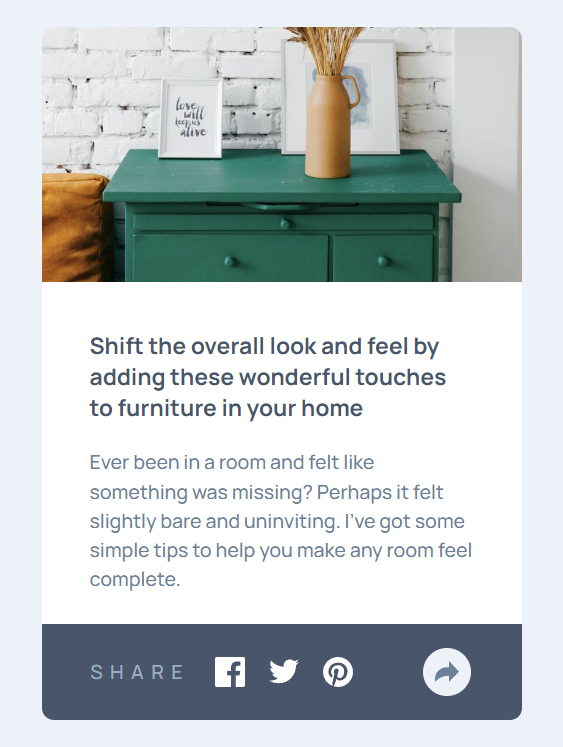

# Frontend Mentor - Article Preview Component Solution

This is my solution to the [Article Preview Component Challenge on Frontend Mentor](https://www.frontendmentor.io/challenges/article-preview-component-dYBN_pYFT). This project helped me improve my coding skills by building a realistic project.

## Table of Contents

- [Overview](#overview)
  - [The Challenge](#the-challenge)
  - [Screenshot](#screenshot)
  - [Links](#links)
- [My Process](#my-process)
  - [Built With](#built-with)
  - [What I Learned](#what-i-learned)
  - [Continued Development](#continued-development)
  - [Useful Resources](#useful-resources)
- [Author](#author)
- [Acknowledgments](#acknowledgments)

## Overview

### The Challenge

Users should be able to:

- View the optimal layout for the component depending on their device's screen size
- See the social media share links when they click the share icon

### Screenshot




### Links

- Live Site URL: [Add live site URL here](https://your-live-site-url.com)

## My Process

### Built With

- Semantic HTML5 markup
- CSS custom properties
- Flexbox
- CSS Grid
- Mobile-first workflow
- Vanilla JavaScript

### What I Learned

While working on this project, I learned how to:

- Use CSS Grid and Flexbox to create responsive layouts.
- Implement a toggle feature using JavaScript to show and hide the share container.
- Apply CSS custom properties (variables) to maintain a consistent color scheme.

Here is a code snippet for the toggle feature:

```js
document.addEventListener("DOMContentLoaded", () => {
  const shareIcon = document.getElementById("share-icon");
  const shareIconHidden = document.getElementById("share-icon-hidden");
  const shareContainer = document.getElementById("share-container");

  shareIcon.addEventListener("click", () => {
    shareContainer.classList.toggle("active");
  });

  shareIconHidden.addEventListener("click", () => {
    shareContainer.classList.remove("active");
  });
});
```

### Continued Development

In future projects, I want to continue focusing on:

- Improving my JavaScript skills, particularly with more complex DOM manipulations.
- Enhancing accessibility features in my web projects.
- Exploring more advanced CSS techniques and animations.

### Useful Resources

- [MDN Web Docs](https://developer.mozilla.org/) - A great resource for HTML, CSS, and JavaScript documentation and tutorials.
- [CSS Tricks](https://css-tricks.com/) - This site has many helpful articles and examples that helped me understand Flexbox and Grid.

## Author

- Frontend Mentor - [@omk1r](https://www.frontendmentor.io/profile/omk1r)
- Twitter - [@omk1rJ](https://www.twitter.com/omk1rJ)

## Acknowledgments

Thanks to the Frontend Mentor community for providing this challenge. It was a great opportunity to practice and improve my front-end development skills.
